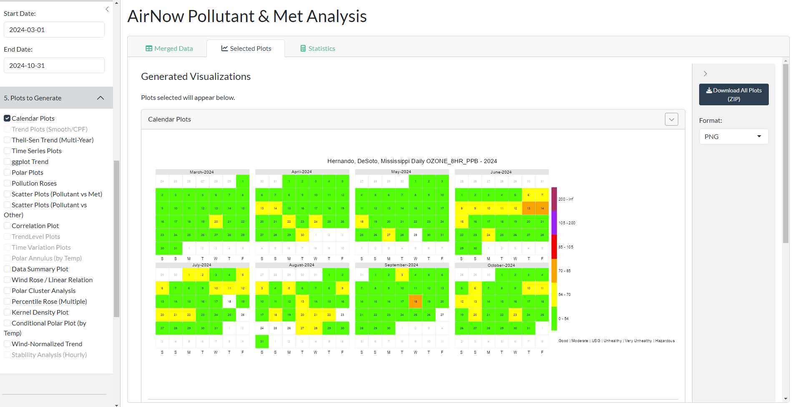

# AirNow Pollutant & Meteorology Analyzer

An R Shiny application for site-specific analysis of air quality and meteorological data. This tool downloads, merges, and visualizes data from official sources like AirNow, NOAA, and IEM, providing a comprehensive toolkit for environmental data exploration.



## Key Features

-   **Categorized Visualization Suite**: Newly organized sidebar with grouped plot selections:
    -   **Temporal Trends (Both)**: Calendar Plots, Time Series, Interactive TrendLevel, and Diurnal/Weekly Time Variation.
    -   **Meteorological & Source (Hourly Only)**: Bivariate Polar Plots, Polar Annulus (Diurnal/Wind), Percentile Roses, Pollution Roses, and Stability Analysis.
    -   **Statistical & Diagnostic (Both)**: Data Summary Heatmaps, AQI Category Proportions (TimeProp), Scatter Plots (Pollutant vs Met), and Correlation Matrices.
-   **Statistical Summaries**: Detailed metrics for both pollutants and weather, including AQI categories and diurnal patterns.
-   **Data Export**: Allows you to download the final merged dataset as a CSV and all generated plots as a ZIP archive.

## How to Run the App

1.  **Clone the Repository**:
    ```bash
    git clone https://github.com/Cuevman81/shiny_aq_met_analysis.git
    cd shiny_aq_met_analysis
    ```
2.  **Install Dependencies**: Open R and run:
    ```r
    install.packages(c("shiny", "bslib", "dplyr", "lubridate", "openair", "readr", "httr", "purrr", "future", "furrr"))
    ```
3.  **Run the App**: Open `Met_Pollutant_Analysis_Airnow_APP.R` and click **Run App**.

## Data Sources

-   **Air Quality**: [EPA AirNow](https://www.airnow.gov/)
-   **Meteorology (Hourly)**: Dual-source. [NOAA ISH](https://www.ncei.noaa.gov/products/land-based-station/integrated-surface-database) for long-term data and **[Iowa Environmental Mesonet (IEM)](https://mesonet.agron.iastate.edu/request/asos.py)** for real-time Hourly ASOS observations.
-   **Meteorology (Daily)**: [IEM ASOS Daily](https://mesonet.agron.iastate.edu/request/daily.phtml)

## Author

*   **Rodney Cuevas** ([RCuevas@mdeq.ms.gov](mailto:RCuevas@mdeq.ms.gov))